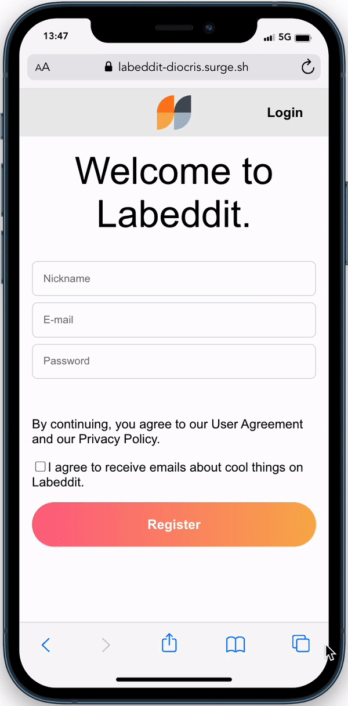
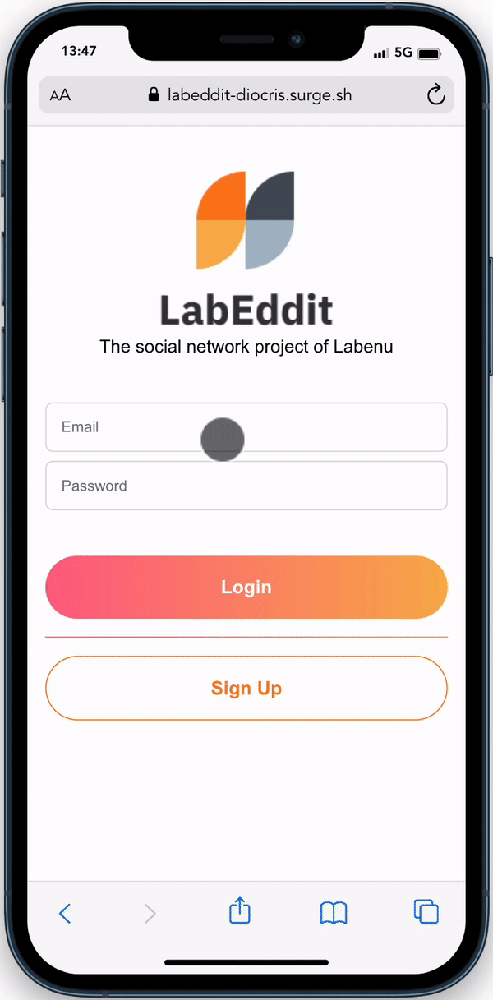
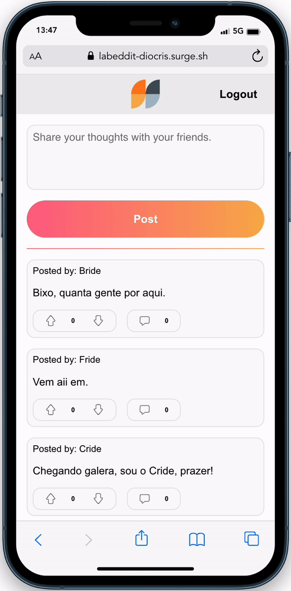
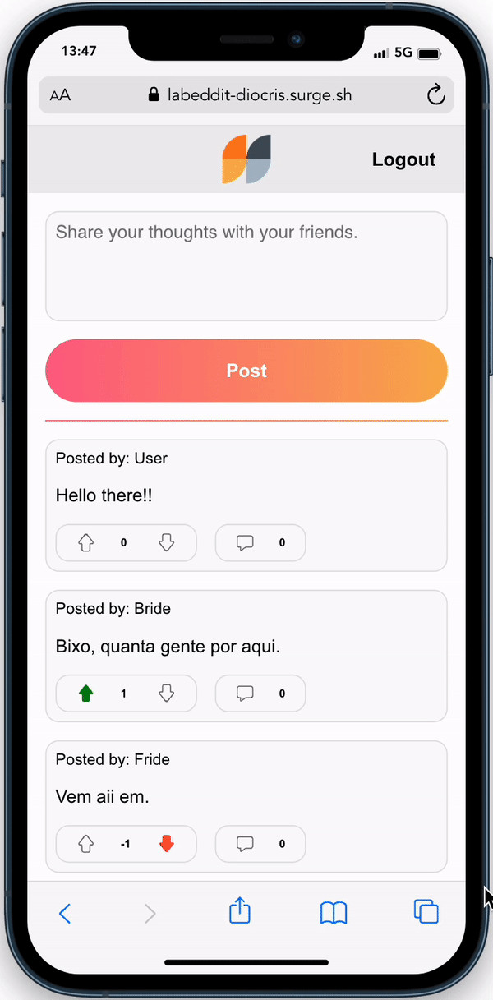

<h1>Labeddit project</h1>

To access the online project, you can click <a href="https://labeddit-diocris.surge.sh/">here</a>.

You can check the backend repository <a href="https://github.com/Diocris/labeddit-fullstack-backend">here</a>.

To run this project in your machine, fork and clone this repository, after that, trought the terminal run the following commands:

<pre>
Install the dependecies:
<code>
npm i
</code>
Run the project:
<code>
npm run start
</code>
</pre>
 

<h2>More details</h2>

The purpose of this web app is to simulate a social network media, where users can interact with posts, comments and likes.

 

<h3>Following the CRUD concepts, in this project we have:</h3>
<ul>
<li>
    <ul><h3>Sign Up page</h3>
        
Used POST method.

        <li>Users can create a new account.</li>
         
        
    </ul>
</li>
 
 
<li>
    <ul><h3>Login page</h3>
        
Used POST method.

        <li>Users can access their account.</li>
         
        
    </ul>
</li>
 
 
<li>
    <ul><h3>Feed page</h3>
        
Used POST, GET and PUT (server-side perform) methods.

        <li>Users can make a new post.</li>
        <li>Users can view all posts from here.</li>
        <li>Users can interact with the posts by liking or disliking them. They can also access a single post page to view its comments.</li>
         
         
    </ul>
</li>
 
 
<li>
    <ul><h3>Post page</h3>
        
Used POST, GET and PUT (server-side perform) methods.

        <li>Users can view the post itself and also it's comments.</li>
        <li>Users can comment the post.</li>
        <li>Users can interact with the comments or the post itself leaving a like or dislike.</li>
         
         
    </ul>
</li>
</ul>
 
 
<h3 style="color: #f81"> Important note:</h3>

This project's backend is hosted on Render using their free service, so please be patient if the application takes some time to perform actions. After all, it is for educational purposes and works quite well for its intended use.

Also, other features like user beeing able to edit a post or a comment, delete a post or comment or even user be able to change their own personal data will be added soon.
