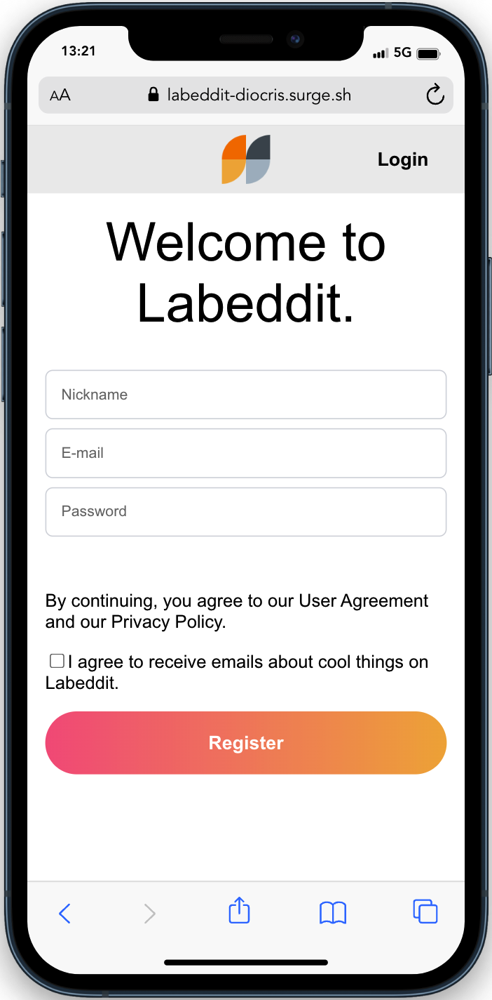

<h1>Labeddit project</h1>

To see the online project your can access here:

<a href="https://labeddit-diocris.surge.sh/">Labeddit - Diocris</a>

To run this project in your machine, fork and clone this repository, after that, trought the terminal run the following commands:

<pre style="height: fit-content">
Install the dependecies:
<code>
npm i
</code>
Run the project:
<code>
npm run start
</code>
</pre>
 

<h2>More details</h2>

The purpose of this web app is to simulate a social network media, where users can interact with posts, comments and likes.

 

<h3>Pages</h3>
<ul>
<li>
    <ul>Sign Up page
        <li>User can create a new account.</li>
        
    </ul>
</li>
 
<li>
    <ul>Login page
        <li>User can access their account.</li>
        
    </ul>
</li>
 
<li>
    <ul> Feed page
        <li>User can make a new post.</li>
        <li>User can see all posts from here.</li>
        <li>User can interact with the posts, liking or disliking it, also they can access a single post page to see it's comments.</li>
    </ul>
</li>
 
<li>
    <ul> Post page
        <li>User can see the post itself and also it's comments.</li>
        <li>User can comment the post.</li>
        <li>User can interact with the comments or the post itself leaving a like or dislike.</li>
    </ul>
</li>

</ul>